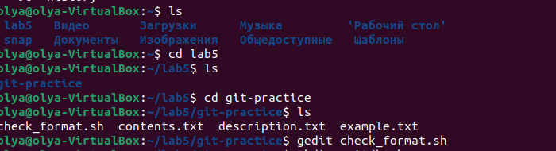
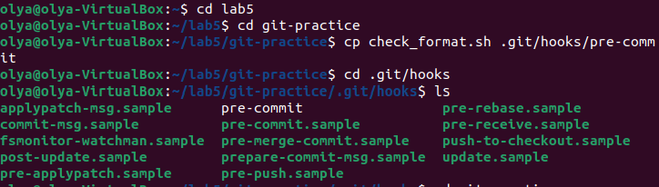

# Лабораторная работа 5
## Подготовка
В первой лабораторной работе я созддаввала ключ для другой виртуальной машины, поэтому создала новый для той, в которой собираюсь работать, поэтому:

создаю ключ для Github и перехожу в файл `ssh`, чтобы скопировать оттуда ключ и вставить его на гитхаб:
```
ssh-keygen
cd ~/.ssh
```

Теперь по заданию лабораторной работы я создаю репозиторий `git-ptactice`, затем в терминале клонирую репозиторий и перехожу в него:
```
git clone git@github.com:cs-itmo-2023/git-ptactice.git
cd git-ptactice
```

Теперь создадаю текстовый файл `example.txt`
```
touch example.txt
```
По заданию вношу изменения в файл example.txt
```
cat >> example.txt
```
Втсавляю стишок и завершаю редактирование файла с помощью сочетания клавиш `ctrl + D`


Я столкнулась с проблемой идентификации, на первых двух строчках картинки представлено решение:

Отправить изменения на гитхаб с предложенным коммитом "File added example.txt" можно с помощью следующих команд:
```
git add example.txt
git commit -m "File added example.txt"
git push origin main
```
По заданию создадаю ветку `feature-branch`:
```
git branch feature-branch
git checkout feature-branch
```
Вношу изменения "show must go on" в файл `example.txt` с этой ветки и завершаю редактирование сочетанием клавиш `ctrl + D`:
```
cat >> example.txt
```
Сохраняю изменения на гитхабе с новым коммитом "File added modified example.txt":
```
git add example.txt
git commit -m "File added modified example.txt"
git push origin main
```
Для того чтобы слить изменения вместе, переключимся на основную ветку:
```
git checkout main
```
А теперь с помощью merge солью изменения с двух веток:
```
git merge feature-branch
git push origin main
```


Вот, что получилось в репозитории на гите:

## Здадание первое - работа с ветками
Создадаю новый файл, с которым и буду работать дальше:
```
touch contents.txt
```
Внесу предложенное содержание - оглавление книги и завершу редактирование `ctrl + D`:
```
cat >> contents.txt
```
Создадаю ветку для разработки новой функциональности:
```
git checkout -b feature-login
```
Вношу изменения и выхожу:
```
cat >> contents.txt
ctrl + D
```
Закоммичиваю изменения на гитхабе:
```
git add contents.txt
git commit -m "Добавлена глава 3: Вход в систему"
git push origin feature-login
```


## Здадание второе - работа с удалённым репо
Переключаюсь на основную ветку:
```
git checkout main
```
Изменяю файл `contents.txt`:
```
cat >> contents.txt
ctrl + D
```
Закоммичиваю изменения с фразой "Изменено название книги и введение":
```
git add contents.txt
git commit -m "Изменено название книги и введение"
git push origin main
```


## Здадание третье - моделирование конфликта
Возвращаюсь в ветку `feature-login`:
```
git checkout feature-login
```
Вношу изменения в файл `contents.txt`:
```
cat >> contents.txt
ctrl + D
```
После чего отправляю изменения на гитхаб с коммитом "Добавлен раздел о магии конфликтов":
```
git add contents.txt
git commit -m "Добавлен раздел о магии конфликтов"
git push origin feature-login
```

## Здадание четвёртое - разрешение конфликта
Возваращюсь в основную ветку и пробую слить изменения:
```
git checkout main
git pull origin main
```
Решаю конфликт в файле `contents.txt`:
```
cat >> contents.txt
ctrl + D
```
Решаю конфликт, удалив метки и оставив нужные изменения:
```
cat >> contents.txt
ctrl + D
```
Теперь отправляю изменения на гитхаб с коммитом "Resolved conflict in chapter 2":
```
git add contents.txt
git commit -m "Resolved conflict in chapter 2"
git push origin main
```


## Здадание пятое - автоматизация проверки формата файлов при коммите
Создадаю скрипт `check_format.sh`:

Скрипт анализирует файл, используя регулярные выражения (grep -Eq), чтобы 
проверить, соответствуют ли строки формату с одним или двумя символами #, за 
которыми следует текст. Затем выводится соответствующее сообщение.

Копирую скрипт в папку `.git/hooks` в файл `pre-commit`:
```
cp check_format.sh .git/hooks/pre-commit
```
Добавляю права доступа файлу `check_format.sh`:
```
chmod +x check_format.sh
```
И файлу `pre-commit`:
```
chmod +x .git/hooks/pre-commit
```
Вношу изменения в `contents.txt`:
```
cat >> contents.txt
```
Пробуею закоммитить и файл вызывается, тк выведена фраза "Укажите путь...":
```
git add contents.txt
git commit -m "Добавлены изменения"
```



## Здадание шестое - использование гитфлоу в проекте 
